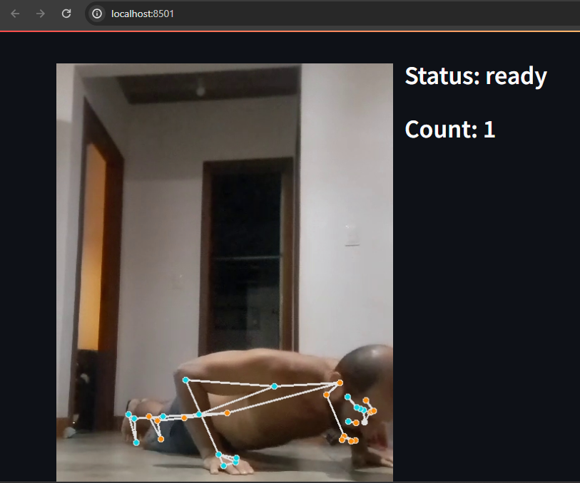

# AI - Case Study - Push Up Counter

> You can find the tutorial for this project on [YouTube](https://youtu.be/Ivummjqaaa8).

## Introduction

---

The Push Up Counter app is a Python application. Basically, the app takes a video file in which a person performs push-ups, and then it counts how many push-ups the person did. The app uses the following libraries:

1. OpenCV as computer vision library to processing images
2. MediaPipe Solutions that provides a suite of libraries and tools quickly apply artificial intelligence (AI) and machine learning (ML) techniques
3. Streamlit as application web library

## Screen

---



## Dependencies and Installation

---

To install the application, please follow these steps:

1. Clone the repository to your local machine.

2. Install the required dependencies by running the following command:

   ```
   pip install -r requirements.txt
   ```

## Usage

---

To use the applicaton, follow these steps:

1. Ensure that you have installed the required dependencies.

2. Run the `personalai_dash.py` file using the Streamlit CLI. Execute the following command:

   ```
   streamlit run personalai_dash.py
   ```

3. The application will launch in your default web browser, displaying the user interface.

## Notes

---

I choose use PyVenv to create virtual envorioment for my Python project, to ensure to use the Python version 3.11

First, make sure install Python 3.11 in your computer.

Make sure create your virtual envionment:

To create the virtual environment, run:

```
python3.11 -m venv name_of_virtual_env
```

For example: python3.11 -m venv venv

To activate your new virtual environment, run:

```
.\name_of_virtual_env\Scripts\Activate.ps1
```

For example: .\venv\Scripts\Activate.ps1

To deactivate your virtual environment, just run:
deactivate

## Requirements.txt commands

---

Install the required dependencies by running the following command:

```
pip install -r requirements.txt
```

Update all dependencies to last version by running the following command:

```
pip install --upgrade -r requirements.txt
```

If you install dependencies manually, to generate the file requirements.txt run the following command:
Para gerar o arquivo requirements.txt com as dependencias instaladas no ambiente virtual usar o comando:

```
pip freeze > requirements.txt
```

## References

---

https://manivannan-ai.medium.com/find-the-angle-between-three-points-from-2d-using-python-348c513e2cd

## Contributing

---

This repository is intended for educational purposes and does not accept further contributions. It serves as supporting material for a YouTube tutorial that demonstrates how to build this project. Feel free to utilize and enhance the app based on your own requirements.

## License

---

The application is released under the [MIT License](https://opensource.org/licenses/MIT).
